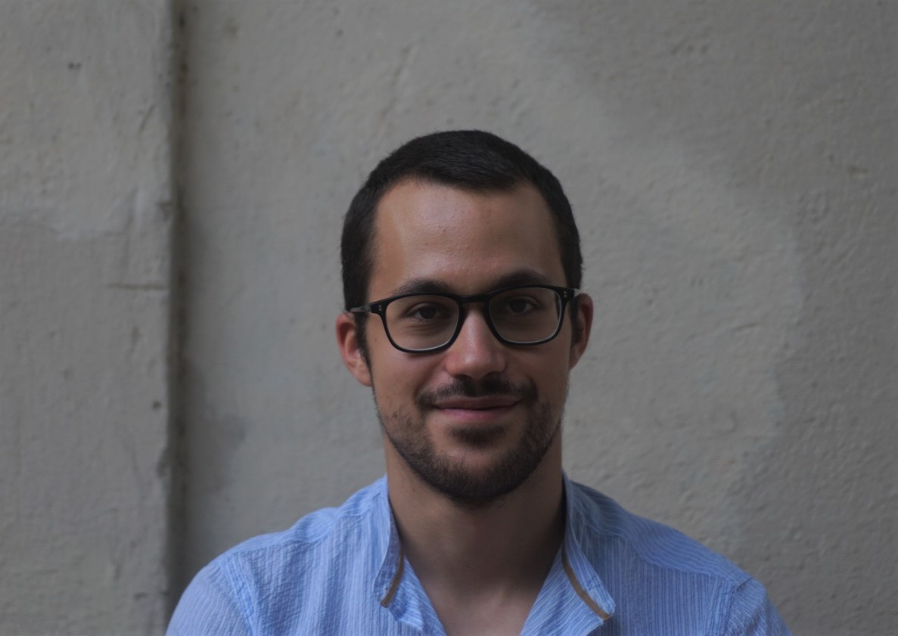

  

 **About me** 

I have obtained my PhD in May 2026 from the Department of Political and Social Sciences of [Universitat Pompeu Fabra](https://www.upf.edu/web/phd-political-and-social-sciences/), Barcelona, and I am set to join the [POLSAFE Project](https://www.carlsbergfondet.dk/en/what-we-have-funded/cf25-1398/?trk=feed-detail_main-feed-card_feed-article-content) at Aalborg University from September 2026. My research interests include policing, incarceration, identity, intersectionality, quantitative methods and causal inference.

More specifically, I'm interested in questions related to police reform, police discrimination, and intersectionality. At the moment, my main focus is on:

**1. Police reform**

I am interested in the effects of bottom-up and top-down efforts to reform law enforcement, with a particular focus on the effect of public policies or social movements. My work is focusing on policies such as marijuana decriminalization/legalization, efforts to defund the police, and the changes induced by movements such as Black Lives Matter, often using quasi-experimental methods.

**2. Intersectional disparities in policing**

Studying policing, I am also interested in studing who is policed. Using millions of administrative records of stops from California that also record the (perceived) queerness, disability, and mental health status of civilians stopped, I analyze disparities in searches, arrests, and use of force under an intersectional lens. Results show a strong risk to be targeted by law enforcement for civilians who are queer, disabled, or have mental health issues, and a double-disadvantage for those who are also Black/Latino.

**3. Rising anti-LGBTQ+ attitudes**

Another strand of my research focuses on the recent rise we are observing in anti-LGBTQ+ attitudes and policies. Using longitudinal data and survey experiments, I look into how resistance to inclusive policies is rising, together with prejudice against the LGBTQ+ community, and how this is particularly driven by transphobic attitudes.

You can also see my <a href="research.html">Research</a> page for more details on my work.

 **Teaching** 

I have also taught BA courses during my doctorate, both as a TA (between courses like Introduction to Sociology, Criminality, and Research Methods Applied to Global Studies) and as a Lecturer (in Introduction to Sociology and Big Data, Mapping & Society). I have taught in both English and Catalan.

Before this, I obtained a [B.A.](https://corsi.unibo.it/1cycle/PoliticalSocialInternationalSciences) and an [M.A.](https://corsi.unibo.it/2cycle/LocalGlobalDevelopment) in Political and Social Sciences from the University of Bologna, Italy. I also worked as a Research Assistant at the University of Modena and Reggio Emilia, Italy, in the Departments of Economics (2020-2021) and Languages (2022), and in an OECD project on Higher Education in Greece (2020-2021).

##

 **Curriculum Vitae** 

You can download my curriculum vitae <a href="files/CV_Murgolo.pdf#" class="download" title="Download CV as PDF">here.</a>

##

 **Contact me** 

You can contact me via email, at emanuele.murgolo[at]upf.edu.

