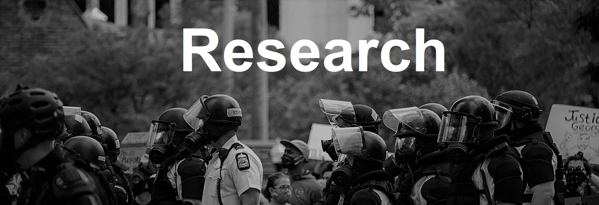

 _[Wikimedia Commons, Paul Becker](https://commons.wikimedia.org/wiki/File:George_Floyd_Protest,_Columbus_%28May_30th%29_George_Floyd_Protest,_Columbus_%28May_30th%29_IMG_2012_%2849954069361%29.jpg)_ 

##
##

 **I am currently working on the following projects:** 

##
##

**1. Marijuana Policies and Racially Biased Policing: When Law Enforcement Backlashes Against Reform**, _with Toni Rodon_

Marijuana policies have been oftentimes pushed by activists and legislators as a way to curb racially biased policing, but literature on the topic is still scarce. In this essay, we analyze ~22 million of traffic and pedestrian stops, asking whether two cannabis policies in Illinois, respectively decriminalizing and legalizing marijuana, successfully shrunk racial disparities and bias in police stops, searches and arrests across the State. Using Interrupted Time Series models and multiple tests of racially biased policing, we present evidence that law enforcement exhibits backlash against cannabis policies, as many indicators of bias do not improve or actually get worse. We support our analysis and proposed mechanism with documentary analysis of parliamentary debates and press from police unions and associations. Our findings highlight the discretionary power that police still retains in the U.S. when confronted with reform, and how this is hindering the chance of improving police performance and accountability.

##
##

**2. Measuring covert sexism from an intersectional perspective**, _with Marina Munoz Puig and Toni Rodon_

