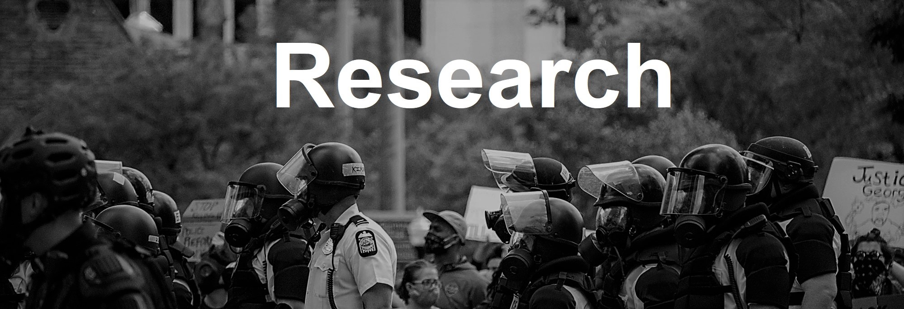

 _[Wikimedia Commons, Paul Becker](https://commons.wikimedia.org/wiki/File:George_Floyd_Protest,_Columbus_%28May_30th%29_George_Floyd_Protest,_Columbus_%28May_30th%29_IMG_2012_%2849954069361%29.jpg)_ 

##
##

 **Peer-Reviewed Articles** 

#### 3. **Murgolo, Emanuele** (2026) Policing Queer and Racialized Identities: an Intersectional Approach to Study Police Bias. *Journal of Race, Ethnicity, and Politics.* | [Publication](https://doi.org/10.1017/rep.2026.10097) | <a href="files/paper_LGBT_policing.pdf#" class="download" title="Download Article as PDF">PDF</a> | [Replication](https://doi.org/10.34810/DATA3433)

<strong>Key Findings</strong>

Using records of approximately 3.1 million police stops in the United States, I examine whether LGBTQ+ civilians face discriminatory policing. The analysis reveals substantial anti-queer disparities in searches, arrests, and use of force, particularly among Black and Latino LGBTQ+ civilians. Findings underscore the importance of adopting an intersectional approach when studying police bias.

##
##

#### 2. **Murgolo, Emanuele** (2026) De-Policing as Reform? Police Tactics after Black Lives Matter’s 2020 Protests. *American Politics Research.* | [Publication](https://doi.org/10.1177/1532673X261443520) | <a href="files/paper_depolicing.pdf#" class="download" title="Download Article as PDF">PDF</a> | [Replication](https://doi.org/10.34810/data3175)

<strong>Key Findings</strong>

Using police stop and crime data from Chicago, this paper examines how the 2020 Black Lives Matter protests affected police behavior. I show that officers adopted a more selective policing strategy, with sharp reductions in stops, searches, and arrests, particularly of Black civilians, while hit rates increased, suggesting a shift toward more targeted and equitable policing.

##
##

#### 1. Gasperoni, Giancarlo, Debora Mantovani, **Emanuele Murgolo**, and Federica Santangelo (2025). "Scelte, Flussi, Segregazione. L’istruzione Secondaria Di I Grado a Bologna, Reggio Emilia e Prato". *Scuola Democratica* | [Publication](http://www.rivisteweb.it/doi/10.12828/116759) | [Coverage](https://www.bolognatoday.it/dossier/sociale/iscrizione-scuole-bologna-elementari-medie-migliori-peggiori.html)

<strong>Key Findings</strong>

The article explores whether the allocation of pupils in secondary schools in three Italian cities is associated with the students' citizenship and parents’ education level, as well as the catchment areas’ social characterization and school profiles. Findings show that equitable access to educational opportunities varies according to pupils’ migratory status, families’ cultural resources and the social profile of catchment areas.

##
##
##

 **Works Under Review** 

#### **Murgolo, Emanuele**. Who is Turning Against LGBT Rights? Evidence from a Longitudinal Study in Catalonia. *Revise and Resubmit*

<strong>Key Findings</strong>

Using two-wave panel data from Catalonia, this article examines the evolution of LGBT-phobic attitudes and their individual-level predictors. Findings show that conservative ideology and older age are associated with higher levels of LGBT-phobia, while being LGBA+ or female predicts greater support for LGBT equality. Negative attitudes significantly increase over time across all groups, and traditional LGBT allies as well, with a particularly sharp growth in transphobia.

##
##

#### **Murgolo, Emanuele** and Toni Rodon. Marijuana Policies and Racially Biased Policing: Law Enforcement Resistance Against Reform? *Under Review*

<strong>Key Findings</strong>

Using approximately 21 million traffic and pedestrian stops, this article examines how marijuana decriminalization and legalization affected racial disparities in policing. The findings show that policy reforms produced limited and uneven reductions in police bias, with racial disparities in stops and searches often persisting after legalization. Results highlight the challenges of achieving significant police reform through isolated policy change.

##
##

#### **Murgolo, Emanuele**, Marina Muñoz Puig and Toni Rodon. The Quiet Pushback: A List Experiment on Opposition to LGBTI+ Inclusive Policies. *Under Review*

<strong>Key Findings</strong>

Using a list experiment in Catalonia, we examine attitudes toward LGBTI+-inclusive policies while accounting for social desirability bias. The findings show that opposition is particularly strong toward transgender-inclusive policies, such as gender-inclusive language and restrooms while equal adoption rights -- an established policy in Catalonia since 2005 -- do not elicit negative responses. The study highlights the uneven nature of support for LGBTI+ equality across different policy domains.

##
##
##

 **Working Papers** 

#### **Murgolo, Emanuele**, and Gerard Torrats-Espinosa. From Policing to Education? Public Spending Reallocation and Minority Student Outcomes in California.

<strong>Key Findings</strong>

This article examines the educational effects of "defund the police" policies that redirected funding from school police departments toward programs supporting minority student achievement in Los Angeles and Oakland. Using quasi-experimental methods, we find that these reforms improved educational outcomes among Black and Hispanic students, increasing graduation rates and test scores while reducing racial achievement gaps.

##
##

#### Christiani, Leah and **Emanuele Murgolo**. Examining Police Targeting by Disability Status, Mental Health Status, and Racial Identity.

<strong>Key Findings</strong>

Using police stop records, this article examines how police treat individuals experiencing mental health crises and people with disabilities. The findings show that these groups are more likely to experience searches, use of force, and psychiatric holds, with particularly high risks among Black and Hispanic individuals experiencing mental health crises. The study highlights how disability and race intersect to shape unequal policing experiences and reproduce historic patterns of criminalization.

